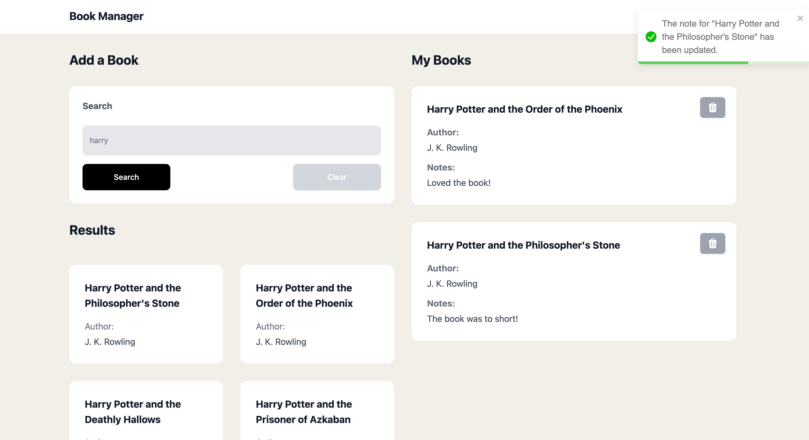

# Book Manager

Welcome to Book Manager - the ultimate app for managing your book notes. Whether you're a voracious reader wanting to keep track of your thoughts on the books you've devoured or a student organizing your study notes, Book Manager is designed to make your life easier.

## Screenshots
# 

## Getting Started

Follow these simple steps to get your own instance of Book Manager running on your local machine for development and testing purposes.

### Prerequisites

Before you begin, ensure you have [Node.js](https://nodejs.org/) installed on your system to use npm (Node Package Manager).

## Installation

#### Clone the repository

    git clone git@github.com:bashcole/book-manager.git

#### Navigate to the project directory:

    cd book-manager

#### Copy the example environment file and configure it as needed:

    cp .env.example .env

#### Install dependencies:

    npm install

#### Start the development server:

    npm run dev

After completing these steps, you can access the application at http://localhost:5173

## Features:

#### Note Management
- [x] **Add Notes**: Seamlessly add new notes to capture your thoughts and insights on books.
- [x] **Edit Notes**: Update your notes as your thoughts evolve or as you gather more insights.
- [x] **Delete Notes**: Remove notes you no longer need, with a confirmation step to prevent accidental deletions.

#### Validation and User Experience
- [x] **Note Size Validation**: Enforces minimum and maximum length for notes to ensure consistency and quality.
- [x] **Animations**: Smooth animations for adding, updating, and deleting notes, enhancing the interactive experience.
- [x] **Notifications on Edit/Add/Delete**: Immediate feedback through notifications when notes are added, edited, or deleted, keeping users informed of their actions.
- [x] **Responsive Design**: A mobile-friendly interface that ensures a seamless experience on all devices.

#### Search and Loading Experience
- [x] **Loading Skeletons**: Provides an immediate visual cue with skeletons during book search, improving user experience during data loading.
- [x] **No Results Placeholder**: Displays informative messages when no search results are found or when there are no notes added yet.

## Built With

- [React](https://reactjs.org/) - The web framework used.
- [Redux](https://redux.js.org/) - State management.
- [TailwindCSS](https://tailwindcss.com/) - For styling.
- [Framer Motion](https://www.framer.com/motion/) - For animation.
- [React Hook Form](https://react-hook-form.com/) - Efficient form management.
- [React Query](https://react-query.tanstack.com/) - Powerful data synchronization for React.